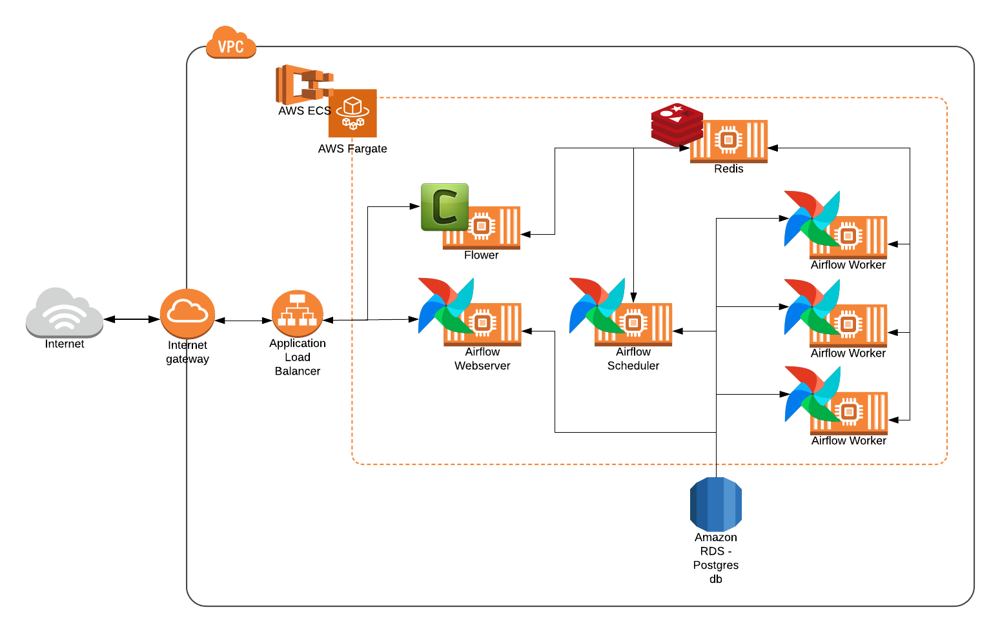

## US Immigration Data Lake

### Data Engineering Capstone Project

#### Goal: To support U.S Customs & Border Protection Department to make better decisions on Immigration Policies

***

### Business Problem

A business consulting firm specialized in data warehouse services through assisting the enterprises with navigating their data needs and creating strategic operational solutions that deliver tangible business results is contacted by U.S Customs & Border Protection Department. Specifically, they want help with the modernization of department's data warehousing infrastructure by improving performance and ease of use for end users, enhancing functionality, decreasing total cost of ownership while making it possible for real-time decision making. In total, the department is asking for a full suite of services includes helping department with data profiling, data standardization, data acquisition, data transformation and integration. 

The U.S. Customs and Border Protection needs help to see what is hidden behind the data flood. As more and more immigrants move to the US, people want quick and reliable ways to access certain information that can help inform their immigration, such as weather of the destination, demographics of destination. And for regulators to keep track of immigrants and their immigration meta data such as visa type, visa expire date, entry method to the US. The consulting firm aim to model and create a brand new analytics solution on top of the state-of-the-art technolgies available to enable department to unleash insights from data then making better decisions on immigration policies for those who came and will be coming in near future to the US.

### Architecture

The whole solution is cloud based on top of **Amazon Web Services (AWS)**. First, all the datasets were preprocessed with **Apache Spark** and stored in a staging area in **AWS S3 bucket**. Then, it is loaded into a **Amazon Redshift** cluster using an **Apache Airflow** pipeline that transfers and checks the quality of the data to finally provide the department a Data Lake for their convenient analysis.

### Data Model

### Scalability

Since this system is built on Spark and Airflow it is very much horizontally scalable. Airflow can handle the processing of millions of records.

***

#### Airflow

A sample of Airflow architecture

[Benefits of Airflow](https://www.xenonstack.com/insights/apache-airflow/)

#### Spark

A sample of Spark architecture

[What is Spark](https://databricks.com/spark/about)

***

### Structure of the Project

The project follows the follow steps:
* Step 1: Scope the Project and Gather Data
* Step 2: Explore and Assess the Data
* Step 3: Define the Data Model
* Step 4: Run ETL to Model the Data
* Step 5: Complete Project Write Up